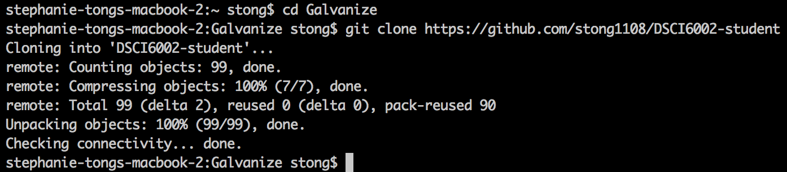
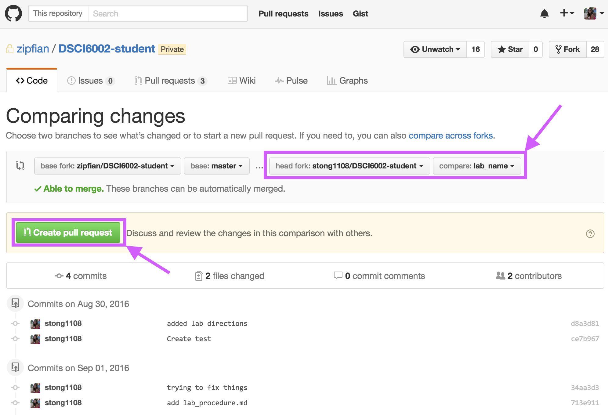

## **Step 0 (THIS STEP ONLY NEEDS TO BE DONE ONCE)**

**Click the 'Fork' button on the course repo (https://github.com/zipfian/DSCI6002-student)**
<br>Fork to your own Github user account.


**Clone your forked copy using Terminal (command line interface)**<br>
Navigate to the directory you want your course repo to exist.

Type `git clone https:/github.com/<username>/DSCI6002-student`, where `<username>` is your Github username.



Set your upstream branch to the Zipfian repo.

Type `git remote add upstream https://github.com/zipfian/DSCI6002-student`


## Step 1: Pull changes from the Zipfian repo

Navigate to your repo in Terminal (learn to use commands like `cd` and `pwd`.

Type the following to switch to the master branch and pull any changes to avoid merge conflicts:
```
git checkout master
git pull upstream master
```


## Step 2: Switch to a new branch for the lab assignment
Type `git checkout -b <branch_name>`, where `<branch_name>` describes the lab assignment.


## Step 3: Work, do stuff
**Note**: You should abide by the 'ABC' rule while working: **A**lways **B**e **C**ommitting.

This is effectively "saving" your work as you go.

To do this, cycle through Steps 4-7 as you work.


## **Step 4: Add changes (and check status)**
Check for changes between your repo on Github and your cloned repo on your computer using `git status`

Type `git add <filename>`to add the changes to `<filename>`.

If you want to add changes for multiple files (`<filename1>` & `<filename2>`), type `git add <filename1> <filename2>`

Or, add all changes for all files using `git add .` Be careful using this command- if you accidentally add a file that is too large to push... fixing it will suck.


## **Step 5: Commit changes**
Commit your changes and add a descriptive message describing what you changed using `git commit -m 'whatever'` (write something else besides `'whatever'`)

Your message must be enclosed by quotes or else git will try to read your message as a command.


## **Step 6: Push changes to your Github repo**
Push your changes to your forked repo on Github.

`git push --set-upstream origin <branch_name>`


## **Step 7: Submit pull request on the gU version of the repo**
Navigate to your forked repo `https://github.com/<yourusername>/<forkedrepo>`.

Click on the 'Pull Requests' tab.

Click the green button that says 'New Pull Request'.


Change your fork's comparison branch to the branch you created for the lab.

Click the green button that says 'Create Pull Request'.



**Write your name and your lab partner's name in the pull request title**.

Finish by clicking the green button that says 'Create Pull Request'.


```python

```
